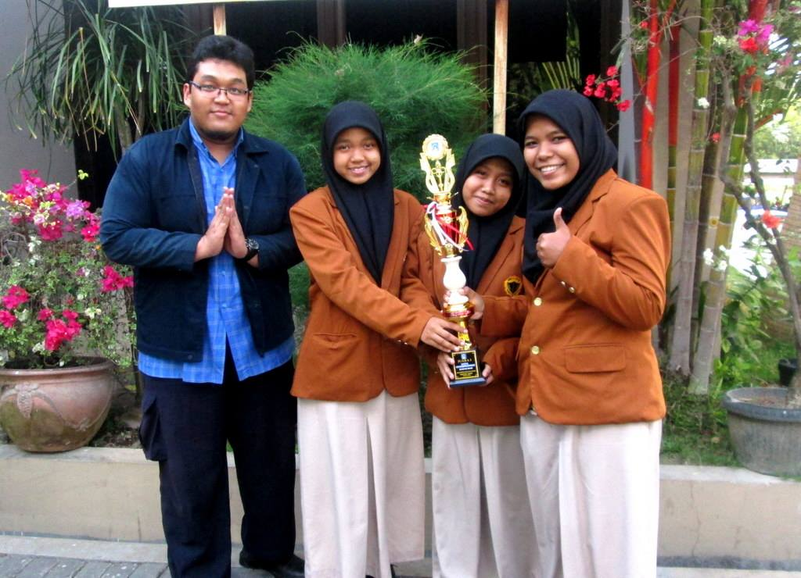

#


# Glove-Eye

### *__Glove-Eye__* is a smart glove with ultrasonic sensor, as mobility guidance solution for the visually impaired. Built with Arduino Uno & ultrasonic sensor HC-SR04. If there's a barrier 1 m in front of the glove, it will buzz & vibrate as a warning sign for the visually impaired.  

### Watch the video below ([click here](https://youtu.be/tl9uDUr10xY)) to see its action, then follow the instructions below to build your own Glove-Eye!

#

[](https://www.youtube.com/watch?v=tl9uDUr10xY)

#

### **1. What You Need** :gift:
To build this project, you need the following items:
- 1 Arduino Uno board
- 1 Ultrasonic HC-SR04 sensor
- 1 buzzer
- 1 LED
- Arduino IDE ([download here](https://www.arduino.cc/en/Main/Software))

#

### **2. Schematics** :wrench::hammer:


#

### **3. Sketch** :clipboard:
 
```c++
int ledPin = 12;  
int buzzerPin = 13;
int echo = 5;
int trig = 6;
long duration, cm;

void setup() {
    pinMode(ledPin, OUTPUT);
    pinMode(buzzerPin, OUTPUT);
    pinMode(echo, INPUT);
    pinMode(trig, OUTPUT);
}

void loop()
{
    digitalWrite(trig, HIGH);
    delayMicroseconds(5);
    digitalWrite(trig, LOW);
    duration = pulseIn(echo, HIGH);
    cm = duration/58;

    if (cm<100){
    digitalWrite(ledPin,HIGH);
    digitalWrite(buzzerPin,HIGH);
    delay(100);
    }
    
    else{
    digitalWrite(ledPin,LOW);
    digitalWrite(buzzerPin,LOW);
    }
}
```

#

### **4. Have Fun!** :sunglasses:
- After uploading done, you can try to use this Glove-Eye. If there's a barrier 1 m (100 cm) in front of the glove, it will buzz to alerting you. Have fun! 

#

### **5. Achievements** :star:
Glove-Eye was assembled by Rini, Ayu & Mia from science team of State Vocational High School 1 Depok __(SMKN 1 Depok Yogyakarta)__ in 2015. You can read their [paper](https://github.com/LintangWisesa/Arduino-Glove-Eye/blob/master/Glove-eye%20Paper.pdf) & [poster](https://github.com/LintangWisesa/Arduino-Glove-Eye/blob/master/Glove-Eye%20Poster.png) attached on this repo. Glove-Eye has been awarded several achievements: 
- :trophy: Finalist of Creanovation Awards Dian Nuswantoro University (2015),
- :trophy: 1st Winner of Technology Competition by Dikpora Sleman (2015), and
- :trophy: Top 5 Science Project Awards Sebelas Maret University (2015).

#



#

#### Lintang Wisesa :love_letter: _lintangwisesa@ymail.com_

[Facebook](https://www.facebook.com/lintangbagus) |
[Twitter](https://twitter.com/Lintang_Wisesa) |
[Google+](https://plus.google.com/u/0/+LintangWisesa1) |
[Youtube](https://www.youtube.com/user/lintangbagus) | 
:octocat: [GitHub](https://github.com/LintangWisesa) |
[Hackster](https://www.hackster.io/lintangwisesa)

